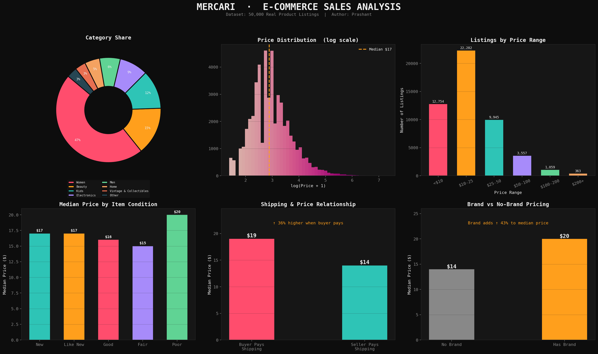
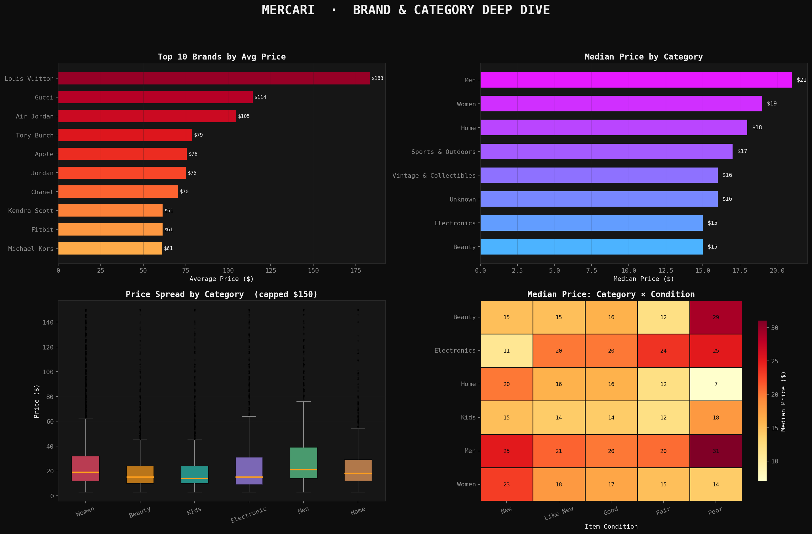

# Mercari E-Commerce Price Analysis

Exploratory Data Analysis of product listings from the Mercari marketplace.

This project analyzes pricing patterns, brand impact, category distribution, and shipping behavior using Python data analysis tools.

---

## Project Overview

Online marketplaces like Mercari contain thousands of listings with different prices depending on brand, condition, shipping, and category.

The goal of this project is to explore:

• What factors influence product price  
• How brands affect pricing  
• Category level price trends  
• Shipping behavior and its impact on price  

---

## Dataset

Mercari Price Suggestion Challenge dataset  
Sample size: **50,000 listings**

Key columns:

- price
- brand_name
- category_name
- item_condition_id
- shipping

---

## Tech Stack

Python  
Pandas  
NumPy  
Matplotlib  
Seaborn

---

## Dashboard Overview

### E-Commerce Sales Dashboard



Key visualizations:

- Category share
- Price distribution
- Price range buckets
- Item condition vs price
- Shipping vs price
- Brand vs non-brand pricing

---

## Brand & Category Deep Dive



Additional analysis includes:

- Top brands by average price
- Category median price
- Price spread by category
- Category × condition heatmap

---

## Key Insights

Brand increases median price by **~43%**

Buyer-paid shipping listings tend to have **~36% higher prices**

Most listings fall in the **$10–$25 range**

Luxury brands like **Louis Vuitton and Gucci dominate the highest average prices**

Men’s category shows the highest median price among major categories

---

## How to Run

Clone the repository

```
git clone https://github.com/YOUR_USERNAME/mercari-price-analysis.git
```

Install dependencies

```
pip install -r requirements.txt
```

Run the analysis

```
python mercari_eda.py
```

---

## Future Improvements

• Build price prediction model  
• Feature importance analysis  
• Interactive dashboard with Streamlit  
• More advanced statistical analysis

---

## Author

Prashant
